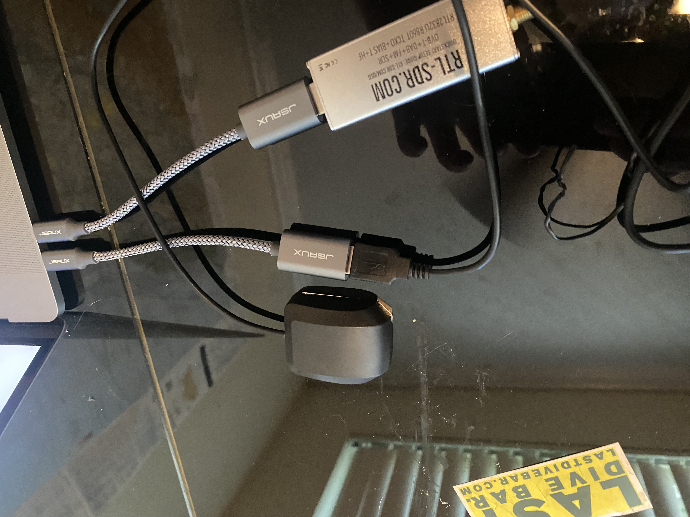
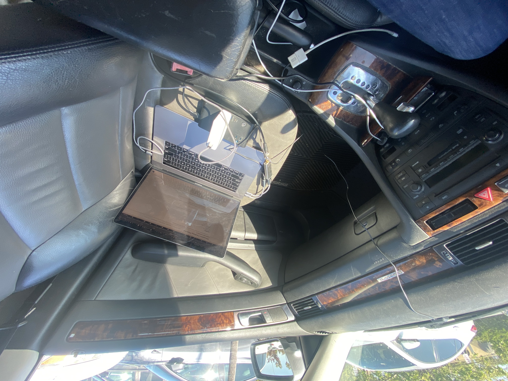
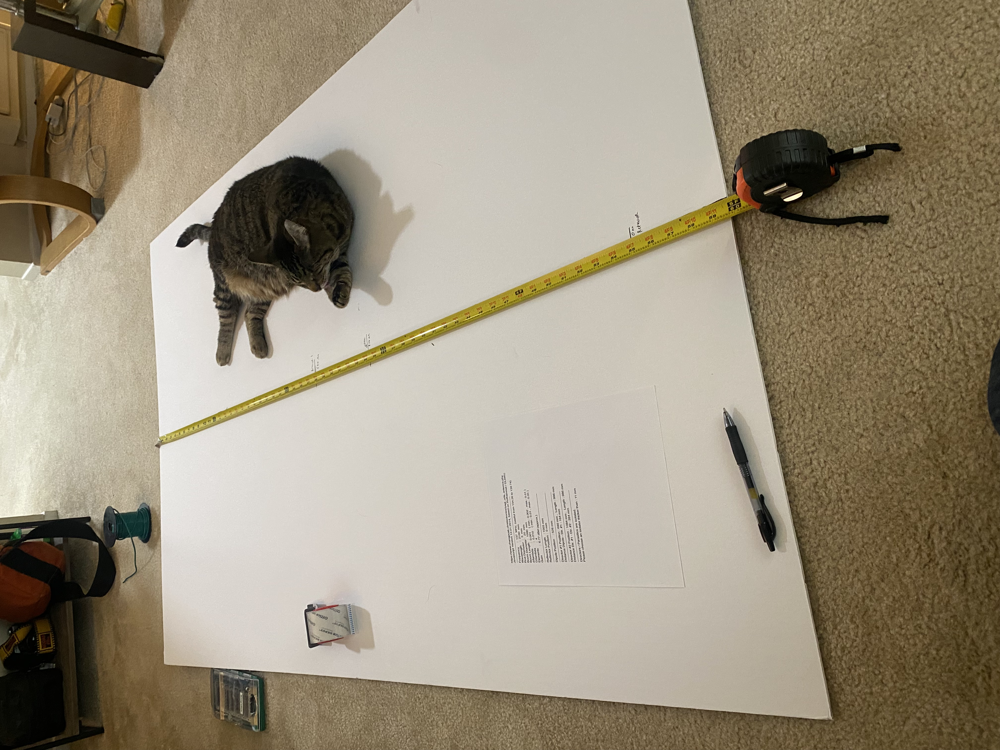
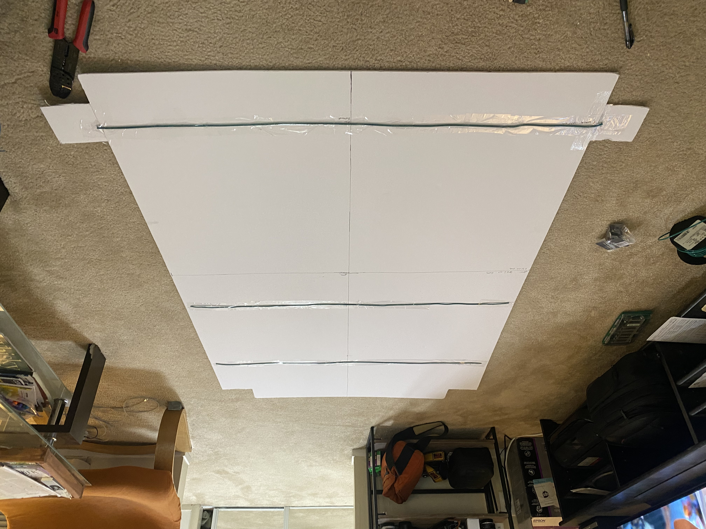
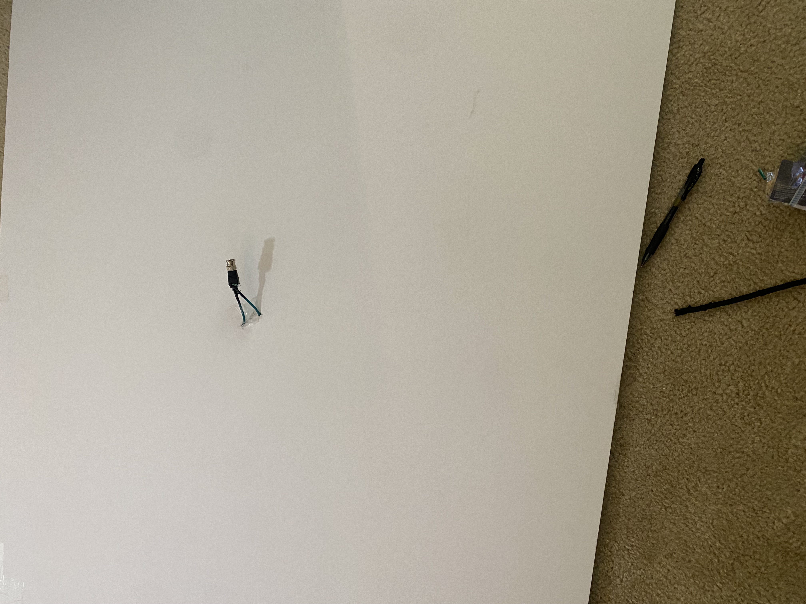
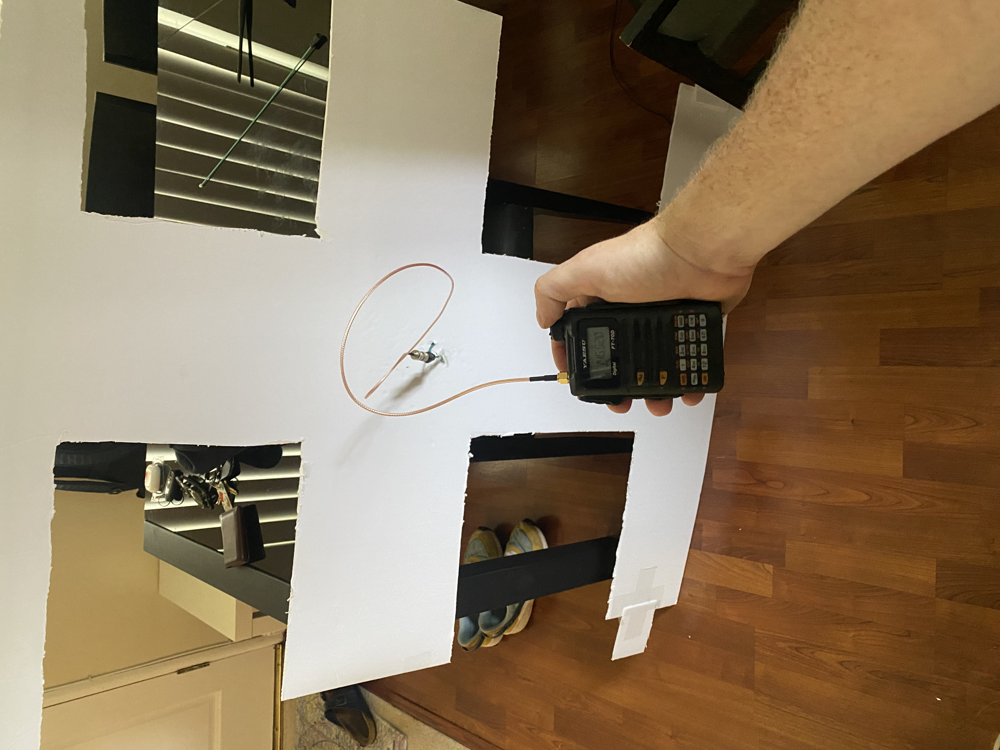

# The Known Electromagnetic Radiation Mapping and Identification Toolkit (KERMIT)

This program is designed to create a map of points along which the RF background has been measured. It's divided up into the following parts:

1. `config.py` is used for maintaining configuration of the program's settings. Feel free to take a read through them and open an issue if they're not readable.
2. `collect_data.py` is the main loop for collecting GPS and signal data. To use this, make sure you go through both the Software and Hardware setup sections first. 
3. `utils.py` stores utility functions and data structures that the source code uses
4. `generate_map.py` is the utility that takes a CSV file generated by `collect_data.py` and spits out a map. It's currently not implemented
5. `sample_signal_distribution.py` is an experimental part of the codebase designed to help build a translation table from observed volume to AM signal gain. It's currently not usable but will be explored in the future.
6. The `test/` directory will eventually contain unit tests.

This toolkit requires a little bit of hardware. For now, you will need:
1. An RTLSDR reciever
2. An antenna of some kind, and a way to connect the antenna to the RTLSDR over SMA
3. A GPS reciever of some kind

I will put the exact details of my personal setup in the "Hardware Setup" section below. Once you have all of that stuf set up and working, it should be pretty simple to run the program on a laptop (or tablet that has python installed) and walk or drive around collecting signals. I plan to use these maps to find defective powerline equipment and report it to the relevant authorities.

For now, this program is supported only on Mac and Linux (and has only been tested extensively on Mac), but in future I would love to support Windows.

Please feel free to open an issue or leave a comment with suggestions, requests, bug reports, or records of what you have done with the project. 

## Software setup

There are some things you need to do to set up the software. Some requirements can not be specified in the `requirements.txt`, as that only works for Python libraries. 

0. Make your copy of the source code. `git clone git@github.com:benhg/kermit.git` and `cd kermit`
1. Install python. This was tested on Python 3.9, but any version newer than Python 3.6 should work.
2. (optional) set up a virtual environment `virtualenv rf-mapper` and `source rf-mapper/bin/activate`
3. Install LibRTLSdr (system .so libraries). `brew install librtlsdr` on mac, or `[apt | yum] install librtlsdr`
4. Install the python dependencies `pip[3] install -r requirements.txt`
5. Take a look through `config.py` and set anything that needs to be changed for your setup. In particular, you should pay close attention to `LISTENING_FREQUENCY`, `SAMPLE_INTERVAL`, `OUTPUT_FILE`, and `ANTENNA_FUDGE_FACTOR`, 

After those steps, you should be able to just start collecting data. To do that, make sure everything from the hardware setup section is plugged in correctly, and run `./kermit collect-data`. You should see no logs of `ERROR` or `WARNING` level if both GPS and RF signals are being recieved correctly. Your system's text to speech engine will announce the signal strength every five samples, by default (tunable with `ANNOUNCE_SIGNAL_EVERY` and `ANNOUNCE_SIGNAL` config options). Some sample log output of a healthy operation looks like this:

```
INFO:root:Read GGA signal GpsResponse<<obscured>, lng=<obscured>, quality=GPS_SPS, sat_count=7, altitude=30.9, error=1.31, timestamp=022745.00> successfully
INFO:root:Found properly functioning GPS device at /dev/cu.usbmodem14401
Found Rafael Micro R820T tuner
[R82XX] PLL not locked!
/usr/local/lib/python3.9/site-packages/numpy/fft/_pocketfft.py:70: ComplexWarning: Casting complex values to real discards the imaginary part
  r = pfi.execute(a, is_real, is_forward, fct)
INFO:root:Signal strength -52.48896895151029 dB (-52.48896895151029).
INFO:root:Read GGA signal GpsResponse<lat=<obscured>, lng=<obscured>, quality=GPS_SPS, sat_count=7, altitude=30.8, error=1.31, timestamp=022746.00> successfully
(...)
```
When you are done sampling, do a ctrl-C. You should see output get appended to the file you specified with OUTPUT_FILE as the collection happens.

To generate a map after doing some sampling, make sure the OUTPUT_FILE set in the `config.py` maps to a correctly populated output CSV created by the sampling process, and run `./kermit generate-map`. The output map will be generated with the same filename as the CSV output file, but there will be a `.html` extension instead of a `.csv` one.

The generated map is an interactive HTML file generated with Plotly and OpenStreetMap. You can choose via `config.py` to open it in the browser (Python will automatically open your browser), save it to an output `.html` file, or both.

## Hardware setup

I used the following components in my testing:

1. 2017 macbook pro
2. A 150w inverter (so I can provide power to the laptop from my car)
3. The rubber-duck antenna that came with my Yaesu FT70DR
4. The Yaesu FT70DR (to generate known strong signals)
5. A [Diamond MR77](https://www.diamondantenna.net/mr77.html) mag-mount antenna
6. [PL259 to SMA adapter](https://www.amazon.com/DHT-Electronics-coaxial-cable-assembly/dp/B00CP11O3E/ref=sr_1_3?crid=2JSP4RETUV2DU&keywords=pl259+male+to+sma+male&qid=1686025830&s=electronics&sprefix=%2Celectronics%2C472&sr=1-3)
7. [This USB GPS antenna](https://www.amazon.com/dp/B078Y52FGQ/ref=sspa_dk_detail_1?psc=1&pd_rd_i=B078Y52FGQ&pd_rd_w=g1H1R&content-id=amzn1.sym.0d1092dc-81bb-493f-8769-d5c802257e94&pf_rd_p=0d1092dc-81bb-493f-8769-d5c802257e94&pf_rd_r=CMR9RQGK22T88FS55B16&pd_rd_wg=KCoqn&pd_rd_r=327dd856-8a30-45a2-abfb-00da5c88df20&s=aht&sp_csd=d2lkZ2V0TmFtZT1zcF9kZXRhaWwy)
8. Some USB-C to USB-A converters
9. an [RTLSDR V3](https://www.rtl-sdr.com/buy-rtl-sdr-dvb-t-dongles/)

The hardware setup is pretty straightforward. You kind of just plug everything into each other. It really goes together only one way. Make sure the antenna and GPS are placed in reasonable locations. I have had success walking around with the laptop in a backpackand the antennas sticking out the top. When driving, I was able to simply place the GPS antenna on my dashboard, and connect the RTLSDR to the mag-mount antenna on my roof.

Here are some pictures of my setup(s):

The test-setup on my dining room table. I screwed the rubberduck antenna from my Yaesu FT70DR onto the SMA input of the RTLSDR for test transmissions. I like those USB-C converters because they let me use both ports next to each other, regardless of how bigthe components are. The RTLSDR is kind of chunky.



The GPS sitting on my dashboard. I've had no problems with GPS reception there.


The whole setup in my passenger seat. The RTLSDR is connected to the feed line of my antenna on the roof. The inverter powers the laptop, which powers the GPS and the RTLSDR. It's pretty easy to install and tear down. And it's pretty compact.



## Command-line arguments

KERMIT is distributed as a group of python files. Both `generate_map.py` and `collect_data.py` can safely run directly from the command line (ie `python3 generate_map.py`). However, this requires looking at the actual source code of the project and therefore is not necessarily desirable. For this reason, we have included a CLI tool `kermit` in the top-level directory of this project to make life a bit easier. You can just call `./kermit` with an action and optional output file override this way. Please note that if you set the output file through the command line argument, it will override the output file provided in the config.py. Please see the full help menu below:

```
ben@benbox:20:02:42[/Users/ben/Desktop/kermit]$ ./kermit -h
usage: kermit [-h] [-o OUTPUT_FILE] action

This is the entry point to KERMIT. It can be used to collect data and generate maps. For more details about KERMIT, please see https://github.com/benhg/kermit#readme

positional arguments:
  action                The action for KERMIT to take. Current options: ['generate-map', 'collect-data']

optional arguments:
  -h, --help            show this help message and exit
  -o OUTPUT_FILE, --output-file OUTPUT_FILE
                        Provide an output file (for data collection) or both an input and an output file (for map generation). Provide a filename with no extension as KERMIT will add appropriate
                        extensions. This output file overrides the one in the config file.
```

## Sampling via line-in

NOTE: this part of the project is currently a TODO. There will be more documentation after it's actually implemented.

One fun idea I had while thinking through this project is to allow users to supply audio signal via line-in from any arbitrary radio as an input stream. There are a few obvious limitations with this, including the fact that this can only work for AM signals, the fact that this program can't necessarily control the RF and audio gain of the radio and computer, and the fact that the mapping between RF signal and audio signal may not be (almost certainly is not) linear.

We still plan to implement this in a limited way with some workarounds/hacks:

1. We plan to take input variables with the various kinds of gain (RF, audio out from radio, audio in to computer) through the `config.py` file so that signal strength corrections can be made
2. The (currently unimplemented) `sample_signal_distribution.py` file should be used to construct an experimentally determined mapping from audio signal strength to RF signal strength. This will rely on an RTLSDR, as that can be queried for both directly. You will need to make a series of calibrated transmissions while this script runs in order to create the mapping. Also, this must be done again (at least in principle) every time any aspect of the setup changes. We plan to provide a few sample mappings in case
3. The radio must be set to recieve in AM mode.

## Secondary Tool: The Posterboard Yagi

Since this is a "toolkit", and not just one program, I thought I'd include something else I'm doing for this same project. I built a Yagi antenna on a posterboard, which I use for finer-grained searching. The basic idea is to drive around the area collecting map data, then going back armed with the map we created along with a directional antenna in order to search more specifically. I built the antenna to these specs:

```
https://www.changpuak.ch/electronics/yagi_uda_antenna.php
Javascript Version 12.01.2014, based on Rothammel / DL6WU
-------------------------------------------------------------
Frequency     :  137  MHz, (useful from 134.26 to 139.74)
Wavelength    :  2190  mm
Rod Diameter  :  3  mm
Boom Diameter :  20  mm
Boom Length   :  1090  mm
d/lambda      :  0.001    ( min.: 0.002 , max.: 0.01 )
D/lambda      :  0.010    ( min.: 0.01 , max.: 0.05 )
Elements      :  4
Gain          :  6.77 dBd (approx.)
-------------------------------------------------------------
Reflector Length   : 1055 mm
Reflector Position :  0 mm
-------------------------------------------------------------
Dipole Position    : 526 mm
-------------------------------------------------------------
Director #1 Position : 690 mm ,  Length : 996 mm
Distance Dipole - Dir. #1 : 164 mm 
-------------------------------------------------------------
Director #2 Position : 1084 mm ,  Length : 986 mm
Distance Dir. #1 - Dir. #2 : 394 mm 
-------------------------------------------------------------
Directors / Parasitics are isolated.
Please choose an isolater thicker than : 11 mm

```

I used some 12-gauge wire I had lying around and a posterboard. I laid out all the wire on the posterboard and kept it in place with some packing tape. I punched the two halves of the dipole through the back of the posterboard and put them into a screw-terminal BNC connector. Then I used a BNC to SMA cable to plug into my HT. There are some progress pictures below.

Here are the parts laid out on the floor (the cat was helpful, but not necessary for the project)



The wires after being measured and attached to the posterboard. I found that I didn't quite have the space for the reflector elements (I should have bought a posterboard one-size up), so I cut out some of the unused space at the top and attached it to the back



I punched the two halves of the dipole through the antenna and connected to a screw-terminal BNC connector I had lying around. After I was sure I had a good contact, I put some liquid electrical tape on the connection to make sure the two elements don't touch each other.



After connecting everything up, attaching a BNC to SMA coax cable, and testing it, I cut out some of the unused area on the posterboard. That makes it a bit easier to hold.



I also plan to build a step attenuator so that I can narrow down the strengths of signals I identify systematically. I'll add details here when I do that.
